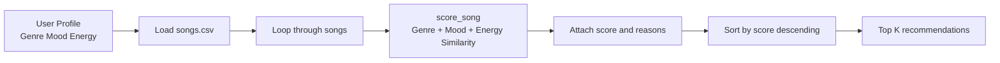
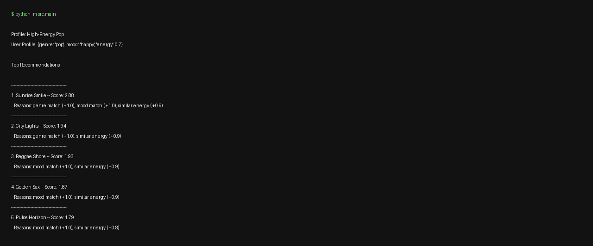
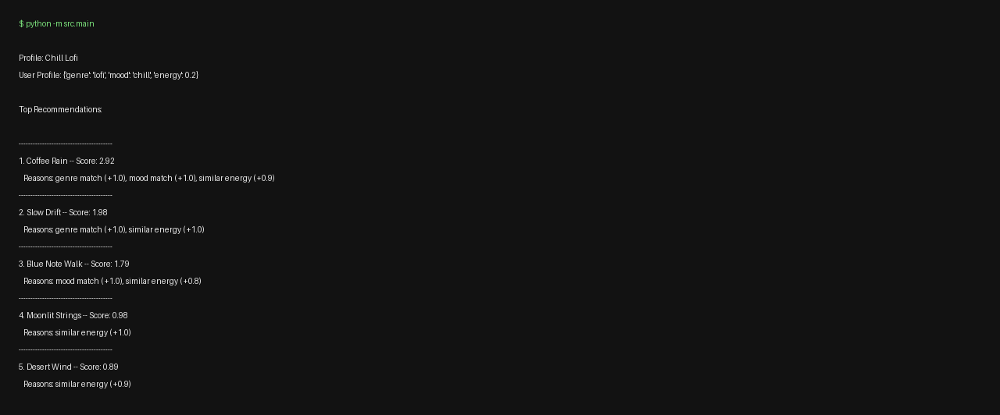
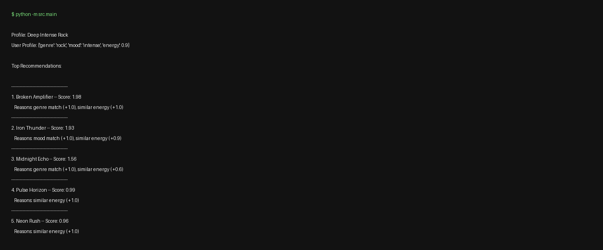
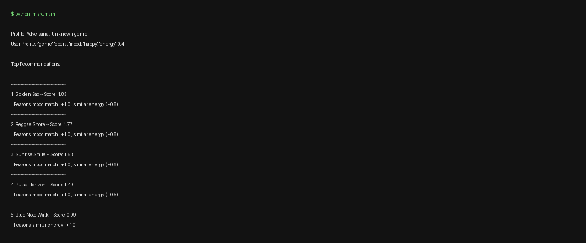

# Music Recommender Simulation

A CLI-first music recommender that transforms song metadata and user taste profiles into ranked recommendations with transparent scoring reasons.

## Phase 1: Understanding The Problem

### Real-World Recommendation Summary
Large platforms such as Spotify, YouTube, and TikTok combine multiple methods. Collaborative filtering predicts what you may like by looking at other users with similar behavior patterns (likes, skips, replays, playlists, completion rate). Content-based filtering focuses on item attributes (genre, mood, energy, tempo, artist style), then matches those attributes to your profile. Real systems usually blend both approaches, plus recency/trend signals, to avoid stale recommendations.

### Data Types Used In Real Systems
- User behavior: likes, skips, replays, saves, playlist adds, watch/listen duration.
- Song metadata: genre, artist, release year, explicitness, tags.
- Audio features: energy, tempo, danceability, valence, loudness.
- Context: time of day, device, recent listening session.

### Features Used In This Simulation

#### UserProfile object
- genre (string)
- mood (string)
- energy (float in [0.0, 1.0])

#### Song object
- title (string)
- genre (string)
- mood (string)
- energy (float in [0.0, 1.0])
- tempo_bpm (integer; currently loaded but not scored)

## Phase 2: Designing The Simulation

### Algorithm Recipe
Scoring Rule (single song):
- +1.0 point for exact genre match.
- +1.0 point for exact mood match.
- +max(0, 1 - abs(song_energy - user_energy)) for energy similarity.

Ranking Rule (song list):
- Compute score for every song.
- Sort descending by score.
- Return top-k songs with explanations.

Why both rules are needed:
- Scoring tells us how relevant one song is.
- Ranking turns all individual scores into a final ordered recommendation list.

### Data Flow Diagram


### Expected Bias Note
This system can create filter bubbles because exact genre matching adds strong points, so songs outside the preferred genre may be under-ranked even if they match mood or energy very well.

## Phase 3: Implementation

Implemented in:
- src/recommender.py
- src/main.py

What is implemented:
- CSV loading with numeric conversion (energy and tempo_bpm).
- Weighted scoring with readable reasons.
- Top-k ranking and formatted CLI output.
- Multiple profile tests plus an experiment mode.

## Phase 4: Evaluation And Explainability

### Profiles Tested
- High-Energy Pop
- Chill Lofi
- Deep Intense Rock
- Adversarial: High energy + sad
- Adversarial: Unknown genre

### Observations
- The profile outputs are directionally correct: Chill Lofi surfaces low-energy/chill songs while Intense Rock surfaces high-energy songs.
- Unknown genre falls back to mood and energy, which still returns plausible results.
- Adversarial profile shows trade-offs: songs can rank high by energy even when mood mismatch exists.

### Data Experiment
Experiment run: Energy-focused weights
- Genre weight changed from 1.0 to 0.5.
- Mood weight kept at 1.0.
- Energy similarity multiplier changed from 1.0 to 2.0.

Result:
- Songs near target energy moved up even without genre match.
- Example: Reggae Shore and Golden Sax climbed for the pop/happy profile due to stronger energy influence.

## Evidence (Terminal Captures)

Generated from the actual run output of python -m src.main:








Raw output artifact: evaluation_output.txt

## Run

```bash
cd music-recommender
python -m src.main
```
